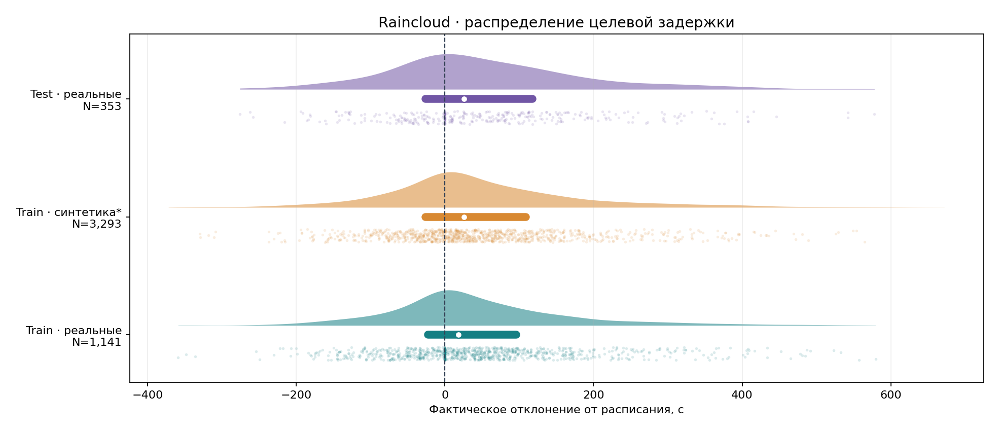
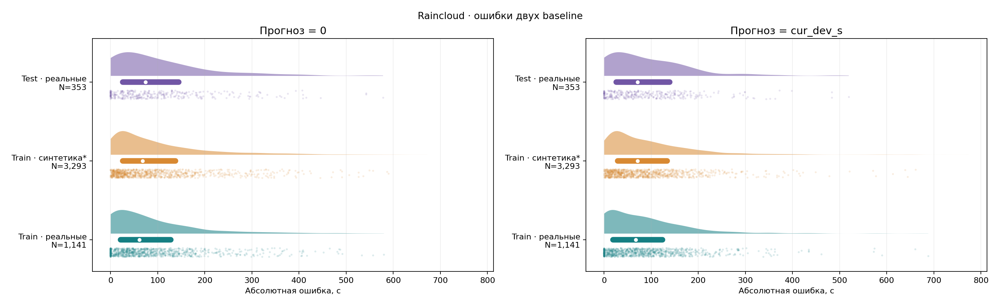
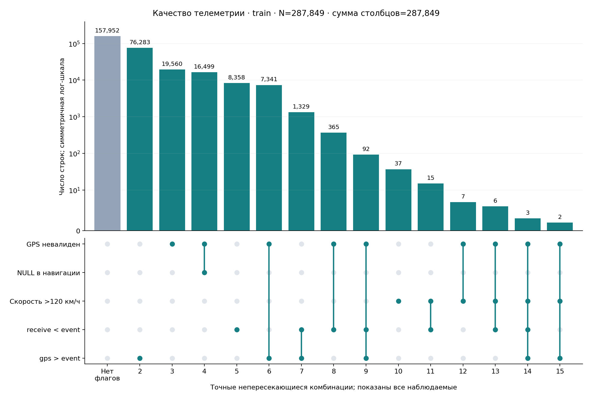
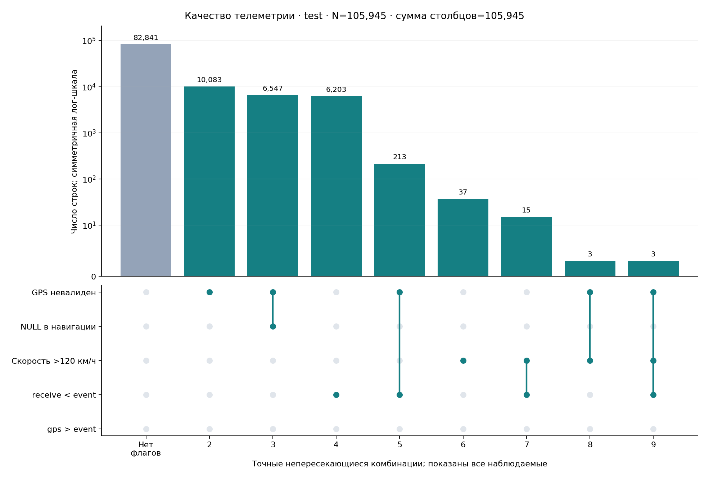
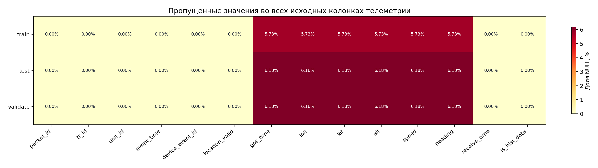
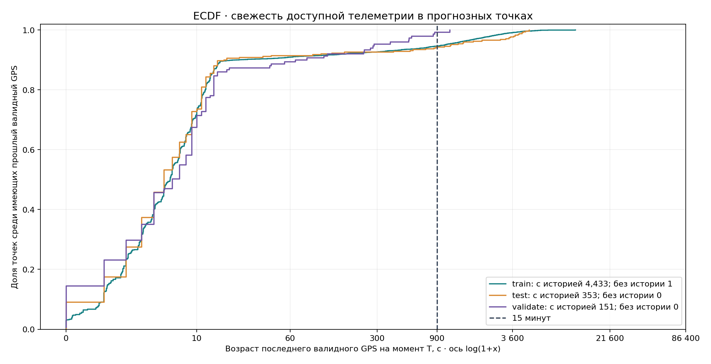
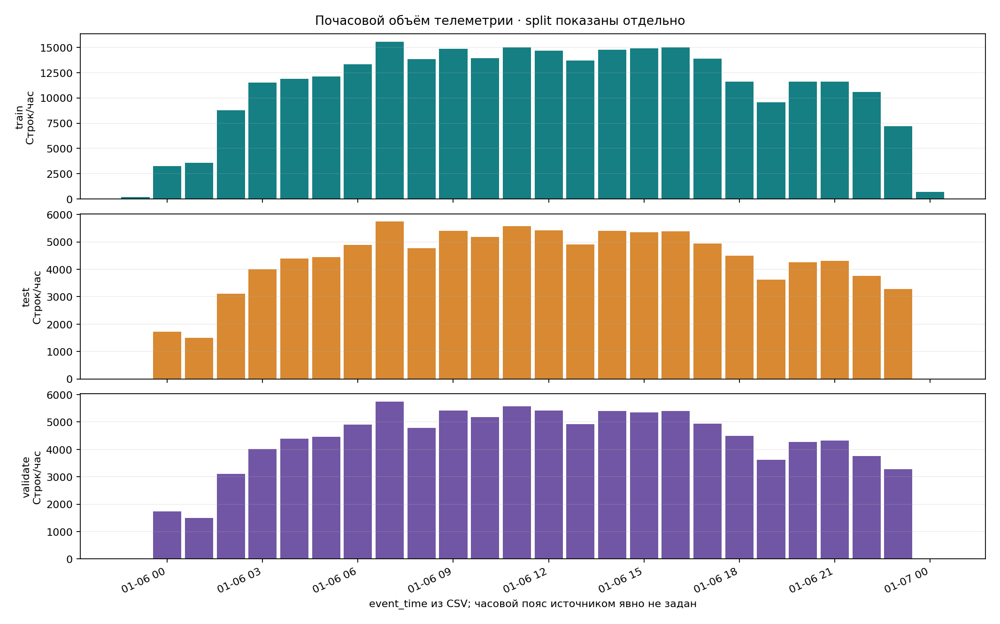
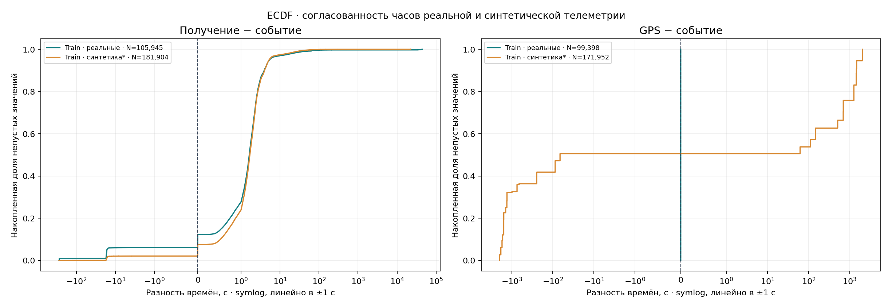

# Анализ текущего датасета

Сгенерировано `analyze.py` из локальной раздачи. Версии библиотек и SHA-256 входов — в `manifest.json`. Исходные файлы не изменялись.

## Основные результаты

- Объём: train 287,849 событий / 4,434 прогнозных точек; test 105,945 / 353; validate 105,945 / 151.
- Невалидные координаты: train 43,875 (15.24%), test 16,849 (15.90%). В train 27,376 таких строк всё же имеют lon/lat: проверки на NULL недостаточно.
- Без валидного GPS в (T−15 минут,T]: train 240, test 20, validate 1. Без всей предшествующей валидной GPS-истории: train 1.
- receive_time раньше event_time: train 10,168, test 6,434. Доступность сообщения и время события требуют разных полей и правил.
- Скорость выше диагностических 120 км/ч: train 70, test 58. Это флаг для изучения, не автоматическое правило удаления.
- Лишние повторения пары (tr_id,event_time): train 8,473, test 2,927. Разные packet_id нельзя удалять только по совпадению этой пары.
- Предположительно синтетическая когорта train: 181,904 событий, 26 ТС и 3,293 точек. Определена по нечисловому packet_id и связи tr_id. Наличие синтетики подтверждено README, точный признак происхождения не дан.
- Baseline train: MAE cur_dev_s = 93.03 с; нулевой прогноз = 97.17 с, n=4434. Официальный score не восстанавливается из приблизительного значения 0.40.
- Baseline test: MAE cur_dev_s = 93.36 с; нулевой прогноз = 103.34 с, n=353. Официальный score не восстанавливается из приблизительного значения 0.40.
- Проверки ключей, склейки, горизонта, таргетов train/test и шаблона: все выполненные проверки прошли (см. checks.csv).

## Пересечения и утечки

Test/validate traffic побайтово одинаковы (SHA-256). Train/test имеют 105,945 общих packet_id из 105,945 test. Прогнозные sample_id и целевые action ID проверяются отдельно в split_overlap.csv. Нельзя считать эти файлы независимыми временными выборками. Не извлекать будущий факт из расписания другого split. Отчёт проверяет таргеты только через собственное расписание train/test; ответы validate не реконструируются.

## Графики

### Распределение целевой задержки

Источник: labels_train.csv и labels_test.csv. Плотность и квартильный интервал рассчитаны по всем значениям; точки — фиксированная случайная выборка до 1000 на группу. Белый маркер — медиана, полоса — Q1–Q3. *Синтетическая когорта определена эвристикой нечислового packet_id; validate targets не используются.

### Распределение ошибок baseline

Источник: labels_train.csv и labels_test.csv. Плотность и квартильный интервал рассчитаны по всем значениям; точки — фиксированная случайная выборка до 1000 на группу. Белый маркер — медиана, полоса — Q1–Q3. *Синтетическая когорта определена эвристикой нечислового packet_id; validate targets не используются. Ошибки вычислены отдельно для каждой точки; это описательная оценка, а не независимый эксперимент.

### Точные пересечения флагов качества · train

Источник: train/traffic.csv. Все наблюдаемые комбинации включены, без отсечения редких; каждая строка входит ровно в один столбец. NULL в навигации — пропуск хотя бы одного из gps_time/lon/lat/alt/speed/heading. Порог скорости 120 км/ч — диагностическая эвристика, а не физический предел. Столбец без флагов не означает доказанную корректность данных. Test и validate идентичны по телеметрии.

### Точные пересечения флагов качества · test

Источник: test/traffic.csv. Все наблюдаемые комбинации включены, без отсечения редких; каждая строка входит ровно в один столбец. NULL в навигации — пропуск хотя бы одного из gps_time/lon/lat/alt/speed/heading. Порог скорости 120 км/ч — диагностическая эвристика, а не физический предел. Столбец без флагов не означает доказанную корректность данных. Test и validate идентичны по телеметрии.

### NULL по колонкам и выборкам

Источник: train/test/validate traffic.csv. Доля pandas.isna() от всех строк соответствующего split; служебная добавленная колонка cohort исключена. Невалидный GPS при заполненных координатах не считается NULL.

### Свежесть GPS на момент прогноза

Источник: points/labels и traffic каждого split; только валидный GPS с event_time ≤ T. ECDF условная: точки без прошлого валидного GPS исключены из знаменателя и отдельно посчитаны в легенде. Receive_time здесь не ограничивает доступность. Ось преобразована log(1+x), подписи в секундах.

### Почасовой объём телеметрии

Источник: traffic.csv каждого split; часы округлены вниз по event_time, без изменения временной зоны. Split нельзя суммировать как независимые наблюдения: test/validate traffic идентичны, их packet_id входят в train. Синтетические временные метки train выходят за границы суток.

### Согласованность временных меток

Источник: train/traffic.csv. ECDF использует все ненулевые разности, без отсечения выбросов. Отрицательная разность означает, что левая временная метка раньше правой. *Эвристика синтетики — нечисловой packet_id. Расхождения требуют отдельного контракта обработки времени.

## Методика и ограничения

- Все численные агрегаты рассчитаны по полным файлам. В raincloud ограничена только точечная визуализация (seed=42); KDE и boxplot используют всю соответствующую выборку. Плотность KDE — сглаженная оценка, не новые наблюдения.
- NULL означает пустую CSV-ячейку, распознанную pandas как отсутствующее значение; это отличается от location_valid=False. Невалидные даты приводят к ошибке запуска, а не исчезают из анализа.
- Пропуски считаются для всех колонок всех девяти входных файлов. UpSet показывает точные, взаимоисключающие комбинации диагностических флагов. Категория без флагов учитывается отдельно.
- Свежесть GPS: T минус последний event_time <= T с location_valid=True и заполненными lon/lat. Событие ровно в T−900с не входит в 15-минутное окно. Отсутствие истории не заменено нулём.
- Часы на графиках — часы исходной временной шкалы без timezone-конвертации. Источник не содержит offset. event_time, gps_time и receive_time не считаются взаимозаменяемыми.
- Когорта real означает числовой packet_id; synthetic_candidate — нечисловой. Это эвристика данной раздачи, не универсальная классификация. Раздельные распределения нужны из-за синтетической аугментации и рассинхронизации часов.
- Границы координат: lon ∈ [−180,180], lat ∈ [−90,90]; heading ∈ [0,360). Прохождение этих проверок не подтверждает географическую правдоподобность траектории.
- Повторные (ТС,время) считаются как дополнительные строки после первой; разрывы — только положительные интервалы между соседними событиями одного ТС. Повторения не очищаются.
- Расписание содержит плановые прибытия, а не справочник физических остановок. В файлах нет route_id/trip_id и статуса дверей: headway и время посадки не вычисляются без допущений.
- MAE — среднее по точкам без взвешивания; разрезы имеют разный размер. Небольшой test и общая история ограничивают выводы об обобщении на новые дни. Между когортами не проводился причинный анализ.

## Что делать дальше

- Хранить packet_id как TEXT, action ID отдельно от ID физической остановки, исходные наносекунды без потери точности.
- Разделить план и фактические времена; выдавать feature builder только допустимые на T данные. Не вычислять признаки из будущего или из объединённых labels.
- Сохранять маски качества, возраст позиции и пропуски. Согласовать fallback при отсутствии свежей телеметрии, а не подставлять скорость 0.
- Согласовать временной контракт и отдельно исследовать часы синтетической когорты; случайное разбиение строк не заменяет временную валидацию.
- Усилить существующий ML eval: one-to-one sample_id join, полное покрытие, запрет дублей и NaN/Inf. Для локальной оценки использовать MAE, а официальный score брать с платформы.

## Таблицы

- [overview.csv](tables/overview.csv): 7 агрегированных строк.
- [missing_values.csv](tables/missing_values.csv): 87 агрегированных строк.
- [numeric_summary.csv](tables/numeric_summary.csv): 51 агрегированных строк.
- [quality_flags.csv](tables/quality_flags.csv): 39 агрегированных строк.
- [baseline_metrics.csv](tables/baseline_metrics.csv): 56 агрегированных строк.
- [hourly_traffic.csv](tables/hourly_traffic.csv): 72 агрегированных строк.
- [quality_intersections.csv](tables/quality_intersections.csv): 33 агрегированных строк.
- [split_overlap.csv](tables/split_overlap.csv): 12 агрегированных строк.
- [checks.csv](tables/checks.csv): 45 агрегированных строк.
